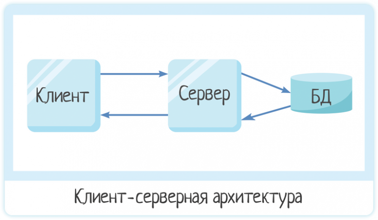
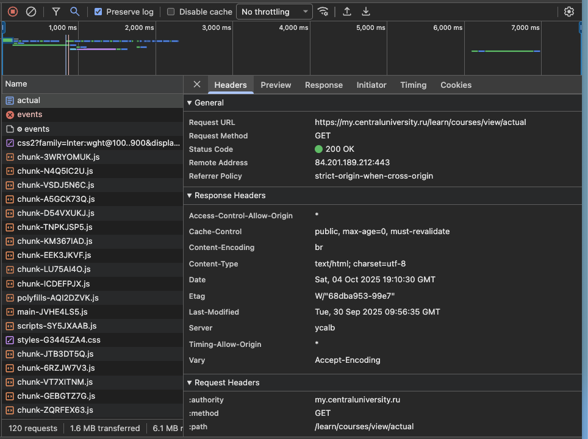
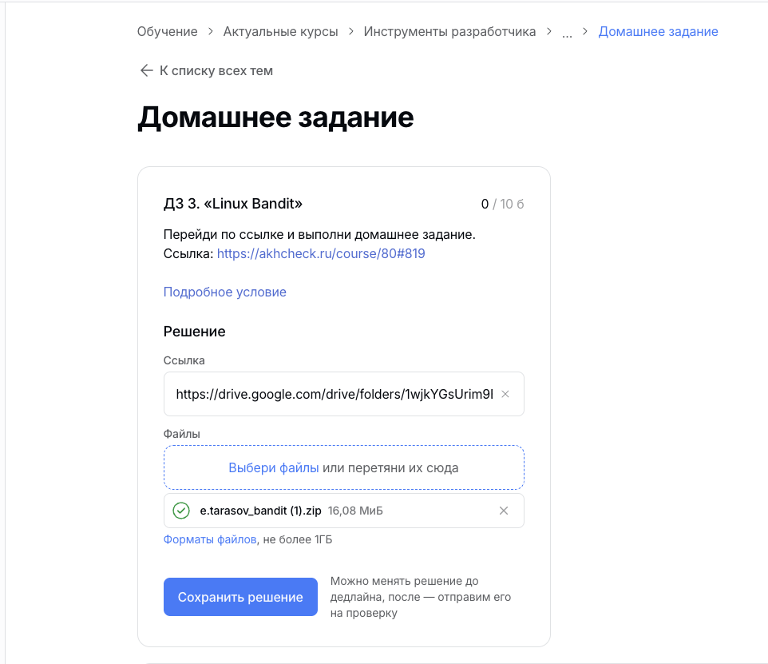
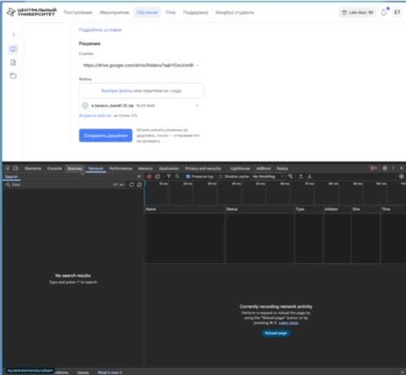
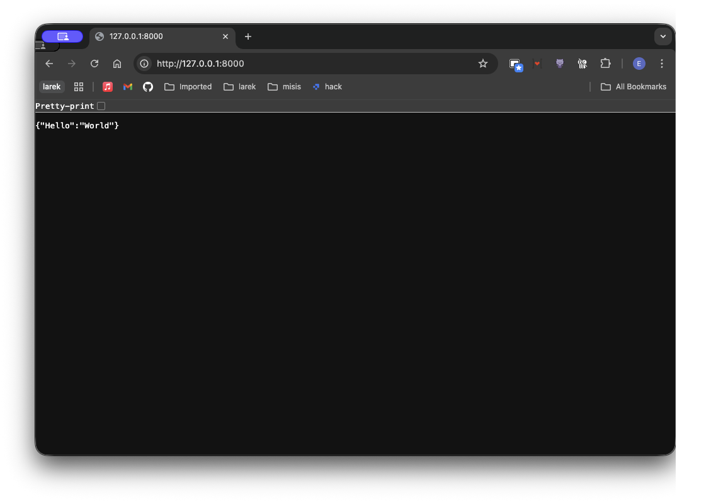
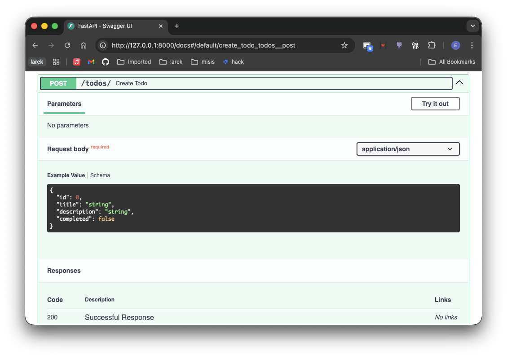

# Введение в web разработку: клиент-сервер, API, REST, Pydantic, FastAPI

## 💡 Что такое **клиент** и **сервер**?

**Клиент** — это устройство или программа, которая запрашивает информацию или услуги.
Например: браузер на твоём ноутбуке или телефоне.

**Сервер** — это мощный компьютер (или несколько), который хранит данные и отвечает на запросы клиентов.
Например: сервер LMS, где хранятся домашние задания, оценки и курсы.



## Пример сценария: отправка домашнего задания на проверку

Давай представим ситуацию:
Мы все студенты ЦУ и на курсах нам задают домашние задания которые мы отправляем в LMS на проверку. Давай на этом примере рассмотрим как устроено взаимодействие между клиентом и сервисом.

1. **Ты — студент**, открываешь сайт LMS в браузере:  
   👉 `https://my.centraluniversity.ru/learn/courses/view/actual`
    - Это твой **клиент** (браузер).
    - Когда ты вводишь адрес, браузер отправляет **запрос** серверу университета.
2. Сервер LMS получает этот запрос.
    - Он проверяет, кто ты (через логин и пароль).
    - Затем отправляет страницу с твоими предметами и на странице курса мы можем найти кнопку отправить домашнее задание.
3. Ты выбираешь файл и нажимаешь кнопку "Отправить" (у себя не нашел не сделанного на момент создания TLDR так что считаем кнопку сохранить ее аналогом).
    - Клиент (браузер) снова отправляет запрос серверу, но теперь с файлом твоей работы.
    - Этот запрос содержит данные: кто ты, на какой курс и какое задание ты отправляешь.
4. Сервер принимает файл, сохраняет его в своей базе данных или файловом хранилище.
    - После этого отправляет клиенту ответ: "Домашнее задание успешно отправлено"
5. На экране твоего браузера появляется сообщение об успехе — это ответ сервера.
   Визуализация Пунктов 3-5



### 🔁 Что происходит “под капотом”

-   Каждый раз, когда ты нажимаешь кнопку или открываешь страницу, клиент (твой браузер) **отправляет HTTP-запрос** серверу.
-   Сервер **обрабатывает запрос**, **достаёт нужные данные** из базы (например, список домашних заданий) и **отправляет ответ** обратно.
-   Ответ приходит в виде веб-страницы (HTML, CSS, JavaScript), которую браузер показывает тебе красиво и понятно.

### 🧩 Пример общения клиента и сервера

| Действие              | Кто    | Что делает                | Пример запроса/ответа                            |
| --------------------- | ------ | ------------------------- | ------------------------------------------------ |
| Открыть LMS           | Клиент | Отправляет запрос на сайт | `GET /home`                                      |
| Проверка логина       | Сервер | Проверяет логин и пароль  | `POST /login`                                    |
| Отправить файл        | Клиент | Загружает задание         | `POST /submit-assignment`                        |
| Сохранить файл        | Сервер | Записывает в базу данных  | —                                                |
| Ответить пользователю | Сервер | Отправляет сообщение      | `{"status": "ok", "message": "Задание принято"}` |

Теперь как мы уже посмотрели, как **клиент** и **сервер** обмениваются сообщениями. Теперь давай разберём, **как именно** они договариваются, _в каком формате и по каким правилам_ это делать.  
Здесь и появляются понятия **API** и **REST**.

### 💬 Что такое API?

**API (Application Programming Interface)** — это **набор правил и способов**, по которым **одна программа может общаться с другой**.

> 👉 Можно сказать, что API — это **“меню” сервера**, где перечислено,  
> что клиент может попросить и как это сделать.

#### 📘 Пример из нашей LMS:

Когда студент нажимает “Отправить домашнее задание”, браузер (клиент) делает запрос вроде:

```bash

PUT https://my.centraluniversity.ru/api/micro-lms/tasks/1/submit

```

В теле запроса он передаёт файл и информацию о задании.  
Сервер принимает этот запрос через **API**, обрабатывает и отвечает, например:

```json
{
    "solutionUrl": "https://drive.google.com/drive/folders/1wjkYGsUrim9E27_FPTDtA0srYC7wWUZk?usp=sharing",
    "attachments": [
        {
            "version": "01096047",
            "filename": "tasks/1/solutions/bandit.zip",
            "name": "bandit.zip",
            "length": 16857201,
            "mediaType": "file"
        }
    ]
}
```

💡 То есть API — это **“договор” между клиентом и сервером**, в котором указано:

-   куда отправлять запрос (`/api/micro-lms/tasks/1/submit`)
-   каким способом (`GET`, `POST`, `PUT`, `DELETE`, и т.д.)
-   что передавать (данные о файле, дату отправки и т.д.)
-   что ожидать в ответе

### 🌐 Что такое REST?

**REST (Representational State Transfer)** — это **стиль проектирования API**, где всё строится на **простых и понятных правилах HTTP** (тех самых, что используют браузеры).

#### 🔑 Основные принципы REST:

1. **Ресурсы** — это данные (например, задания, студенты, курсы).  
   Каждый ресурс имеет свой адрес (URL).  
   Пример:
    - `GET /api/assignments` → получить все задания
    - `POST /api/assignments` → отправить новое задание
    - `GET /api/assignments/12` → получить конкретное задание №12
2. **Методы HTTP** говорят, что делать (более подробно про методы и статусы можно почитать [тут](https://developer.mozilla.org/ru/docs/Web/HTTP/Reference/Status))

| Метод    | Что делает           | Пример                  |
| -------- | -------------------- | ----------------------- |
| `GET`    | Получить данные      | Список домашних заданий |
| `POST`   | Создать новые данные | Отправить задание       |
| `PUT`    | Изменить данные      | Обновить задание        |
| `DELETE` | Удалить данные       | Удалить задание         |

3. **Ответ сервера** почти всегда в формате JSON — это просто текст, который легко читают программы:

```json
{
    "student": "Иван Петров",
    "assignment": "Лабораторная 3",
    "status": "Принято"
}
```

4. **Без сохранения состояния** — сервер не “помнит” прошлые запросы.  
   Каждый запрос должен содержать всю нужную информацию (например, токен пользователя).

## Практика с FastAPI и Pydantic

Итак, мы узнали что такое клиент, сервер, API и REST. Теперь давай попробуем создать свое простое приложение TODO с помощью FastAPI и Pydantic.

### Установка FastAPI и Uvicorn

Для начала нам нужно установить FastAPI актуальную инструкцию можно найти на сайте [FastAPI](https://fastapi.tiangolo.com/virtual-environments/#install-packages).

```bash
pip install "fastapi[standard]"
```

Для запуска нашего приложения мы будем использовать CLI (приложение командной строки) [FastAPI](https://fastapi.tiangolo.com/tutorial/#run-the-code). Где `fastapi` - это команда, `dev` - режим разработки, `main.py` - файл с нашим приложением.

```bash
fastapi dev main.py

   FastAPI   Starting development server 🚀

             Searching for package file structure from directories
             with __init__.py files
             Importing from /home/user/code/awesomeapp

    module   🐍 main.py

      code   Importing the FastAPI app object from the module with
             the following code:

             from main import app

       app   Using import string: main:app

    server   Server started at http://127.0.0.1:8000
    server   Documentation at http://127.0.0.1:8000/docs

       tip   Running in development mode, for production use:
             fastapi run

             Logs:

      INFO   Will watch for changes in these directories:
             ['/home/user/code/awesomeapp']
      INFO   Uvicorn running on http://127.0.0.1:8000 (Press CTRL+C
             to quit)
      INFO   Started reloader process [383138] using WatchFiles
      INFO   Started server process [383153]
      INFO   Waiting for application startup.
      INFO   Application startup complete.
```

### Создание первого эндпоинта

Теперь давай создадим файл `main.py` и напишем в нем наш первый эндпоинт.

```python
from fastapi import FastAPI

app = FastAPI()

@app.get("/")
def index():
    return {"Hello": "World"}
```

Теперь мы можем запустить наше приложение с помощью команды `fastapi dev main.py` и открыть в браузере [http://127.0.0.1:8000](http://127.0.0.1:8000). Мы должны увидеть JSON ответ `{"Hello": "World"}`.



### Создание модели данных с Pydantic

Теперь давай создадим модель данных для нашей задачи TODO с помощью Pydantic. Pydantic позволяет нам легко валидировать и сериализовать данные. Используя класс `BaseModel`, мы можем определить структуру наших данных. Давай теперь создадим модель `Todo` и добавим эндпоинт для создания задачи. Для создания мы будем использовать метод `POST`. Метод `http` указывается в декораторе `@app.post("/")`.

```python
from pydantic import BaseModel
from fastapi import FastAPI

class Todo(BaseModel):
    id: int
    title: str
    description: str | None = None
    completed: bool = False


app = FastAPI()

@app.get("/")
def index():
    return {"Hello": "World"}

@app.post("/todos/")
def create_todo(todo: Todo):
    return todo

```

Теперь мы можем перейти в документацию нашего API по адресу [http://127.0.0.1:8000/docs](http://127.0.0.1:8000/docs). Там мы увидим наш новый эндпоинт `POST /todos/`, где мы можем создать новую задачу. В документации мы можем нажать на кнопку "Try it out", заполнить поля и отправить запрос. в ответ мы получим JSON с нашей задачей.



### Хранение задач в памяти

В реальном приложении задачи обычно хранятся в базе данных. Но для простоты мы будем хранить их в памяти с помощью словаря. Давай добавим возможность получать список всех задач и удалять задачи по ID.

Так же зная что сервер может отправлять ошибки, мы добавим обработку ошибок с помощью `HTTPException`. В местах где может возникнуть ошибка мы будем выбрасывать исключение с нужным статус кодом и сообщением. Когда пользователь попытается удалить несуществующую задачу, он получит ошибку 404 с сообщением "Todo not found". Если он попытается создать задачу с уже существующим ID, он получит ошибку 400 с сообщением "Todo with this ID already exists".

```python
from pydantic import BaseModel
from fastapi import FastAPI, HTTPException


class Todo(BaseModel):
    id: int # добавляем поле id для идентификации задачи.
    title: str
    description: str | None = None
    completed: bool = False


app = FastAPI()

# Хранилище задач в памяти
db = {}


@app.get("/")
def index():
    return {"Hello": "World"}


@app.post("/todos/")
def create_todo(todo: Todo):
    if todo.id in db:
        raise HTTPException(status_code=400, detail="Todo with this ID already exists")
    db[todo.id] = todo
    return todo


@app.get("/todos/")
def get_all_todos():
    return list(db.values())


@app.delete("/todos/{todo_id}")
def delete_todo(todo_id: int):
    if todo_id not in db:
        raise HTTPException(status_code=404, detail="Todo not found")
    del db[todo_id]
    return {"message": "Todo deleted successfully"}

```

Теперь мы можем создавать задачи, получать список всех задач и удалять задачи по ID. Мы можем протестировать все эти эндпоинты в документации по адресу [http://127.0.0.1:8000/docs](http://127.0.0.1:8000/docs).


### Заключение

Поздравляю! Мы создали простое приложение TODO с помощью FastAPI и Pydantic. Мы узнали, как создавать эндпоинты, работать с моделями данных и обрабатывать ошибки. Это только начало, и с FastAPI можно создавать гораздо более сложные и мощные приложения. Удачи в изучении веб-разработки! 🚀

## Полезные материалы

-   [Серия статей про HTTP от Avito.Tech](https://habr.com/ru/companies/avito/articles/710660/)
-   [Не HTTP единым. Классное видео про клиент-серверную архитектуру и общее их взаимодействие](https://www.youtube.com/watch?v=XaTwnKLQi4A)
-   [Необходимая база для веб-разработчика](https://vladislaveremeev.gitbook.io/qa_bible/seti-i-okolo-nikh)
-   [Отличная документация по FastApi](https://fastapi.tiangolo.com/tutorial/first-steps/)
-   [Про REST API от Яндекса](https://yandex.cloud/ru/docs/glossary/rest-api)
